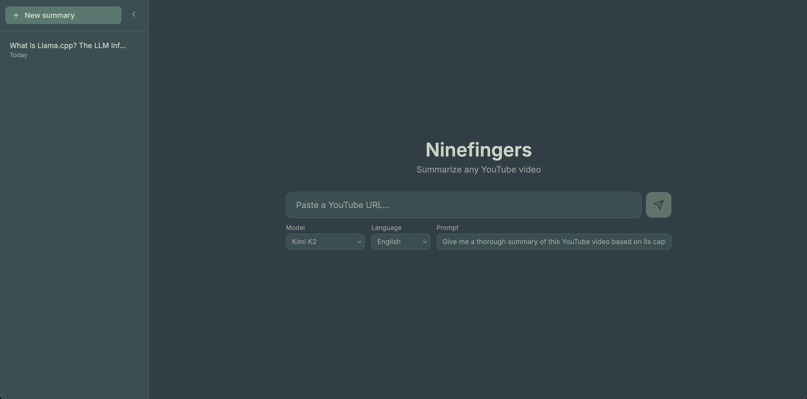

# Ninefingers

Summarize any YouTube video instantly. Fetches captions and streams an AI summary to your browser or terminal.



## Setup

1. Get an API key from [NVIDIA](https://build.nvidia.com)
2. Create `.env` and set `NVIDIA_API_KEY=your_key_here`
3. Install `yt-dlp`: `pip install yt-dlp`

## Usage

**Web UI** (recommended):
```sh
make build && ./ninefingers serve
```
Opens `http://localhost:8080` — paste a YouTube URL, pick a model, get a summary instantly. History saved locally.

**CLI**:
```sh
./ninefingers "https://www.youtube.com/watch?v=..." --model "moonshotai/kimi-k2-instruct" -v
```

**Development** (live reload):
```sh
make dev
```

## Features

- **Stream tokens live** — see the summary appear in real-time
- **Markdown rendering** — summaries formatted with headings, lists, etc.
- **Embedded video** — watch alongside the summary
- **History** — all past summaries saved and searchable
- **Multiple models** — GLM-4.7, Kimi, Llama, DeepSeek, Gemma
